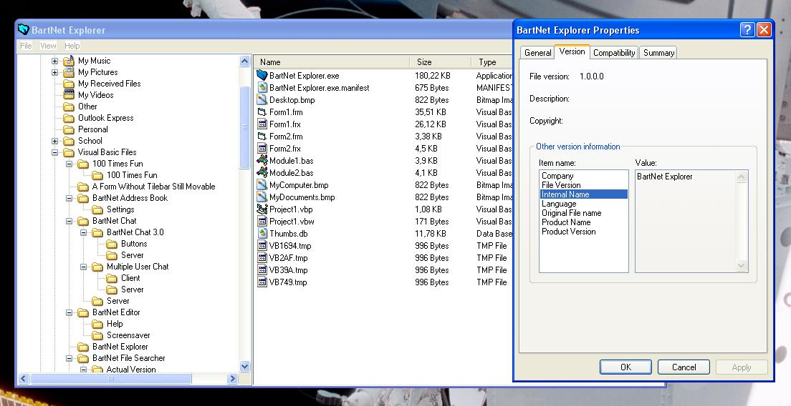



## \_BartNet Explorer\_

### Description

BartNet Explorer is a bit like Windows explorer. It uses the Microsoft Scripting Runtime reference to find the files and folders. Some options include changing views, creating new folders, viewing file and folder information and refresh view.
 
### More Info
 

             |
---                |---
**Submitted On**   |2003-01-25 21:35:26
**By**             |[BelgiumBoy\_007](https://github.com/Planet-Source-Code/PSCIndex/blob/master/ByAuthor/belgiumboy-007.md)
**Level**          |Intermediate
**User Rating**    |3.9 (27 globes from 7 users)
**Compatibility**  |VB 6\.0
**Category**       |[Files/ File Controls/ Input/ Output](https://github.com/Planet-Source-Code/PSCIndex/blob/master/ByCategory/files-file-controls-input-output__1-3.md)
**World**          |[Visual Basic](https://github.com/Planet-Source-Code/PSCIndex/blob/master/ByWorld/visual-basic.md)
**Archive File**   |[\_BartNet\_E1534891262003\.zip](https://github.com/Planet-Source-Code/belgiumboy-007-bartnet-explorer__1-42720/archive/master.zip)

